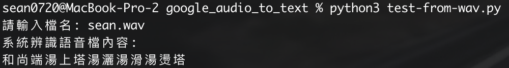

# Google Speech Recognition
<p align="left"></p>

### Prepare Installations
```
pip3 install SpeechRecognition
brew install portaudio
pip3 install PyAudio
```

### Run

- With microphone:<br/>
```
python3 test.py
```

- With .wav file:<br/>
```
python3 test-from-wav.py
```

You can enter any file name of .wav files which in folder "audio",<br/>
ex: test.wav
